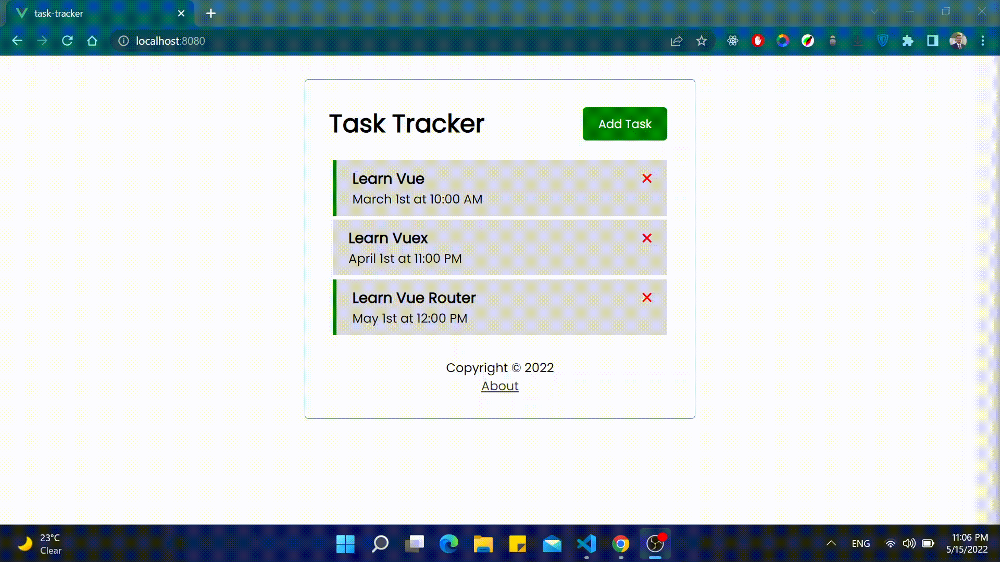

# Task Tracker

It is a simple task tracker built with Vue JS. It enables you to create goals for yourself and set a day and a reminder to them.

This project was inspired from [Traversy Media Vue JS Crash Course](https://youtu.be/qZXt1Aom3Cs) 🙌🏽❤️

## Preview



## Project setup

```bash
git clone https://github.com/abdullahalshawafi/Task-Tracker.git
cd Task-Tracker/
npm install
```

### Compile and hot-reloads for development

```bash
npm run serve
```

### Compile and minify for production

```bash
npm run build
```
